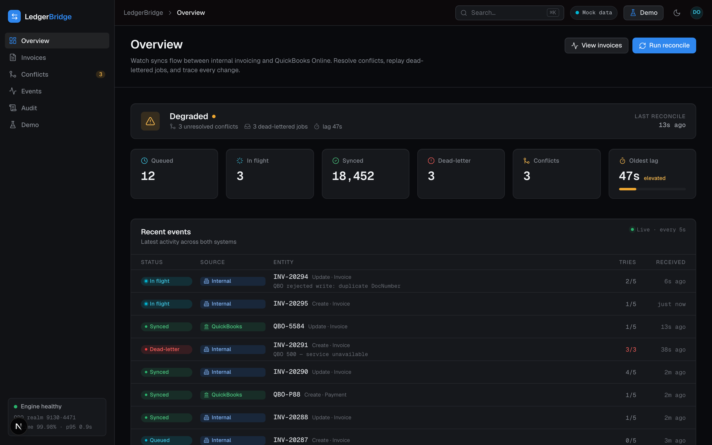
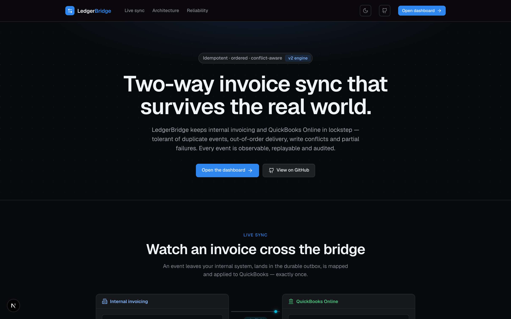
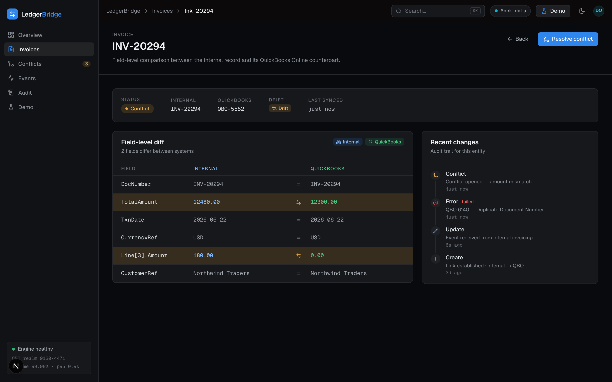
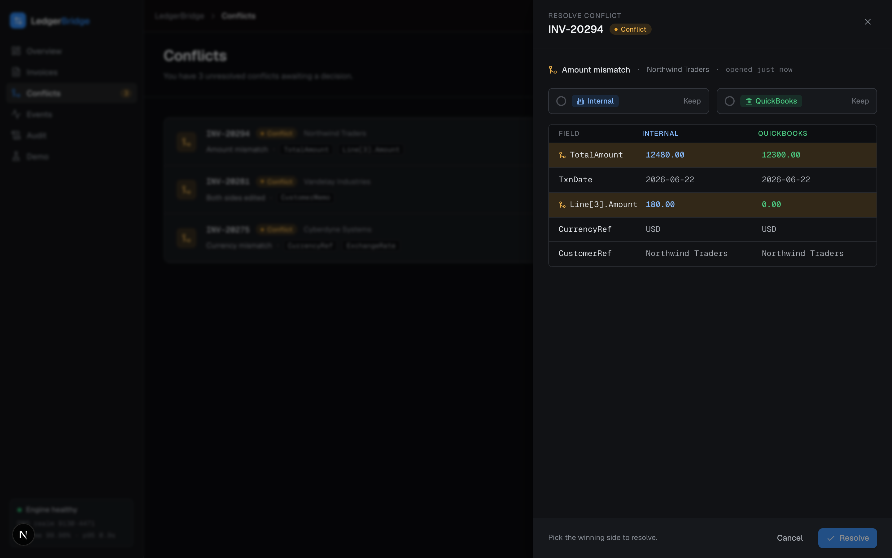
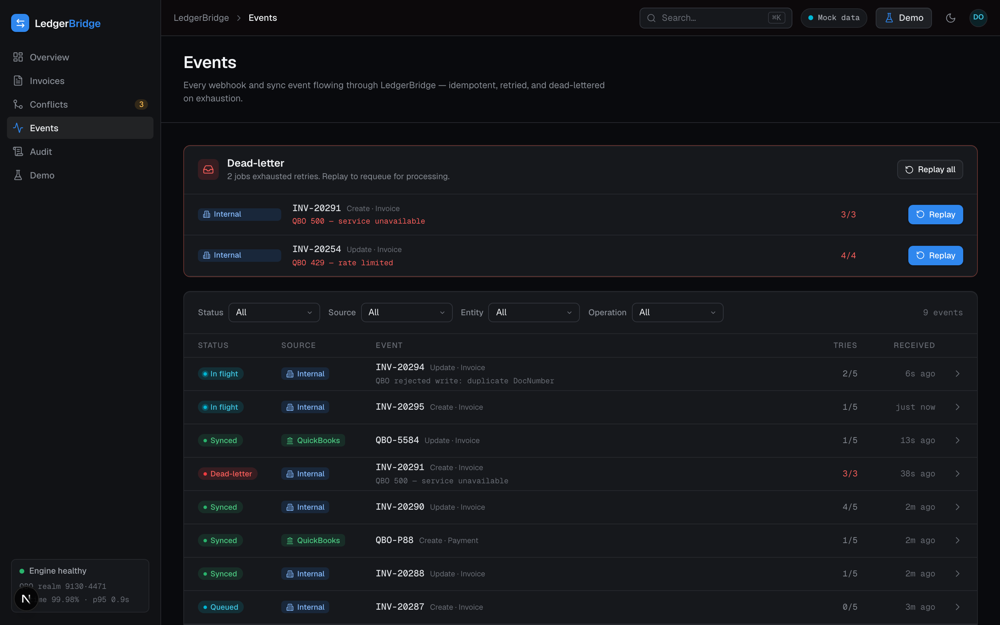
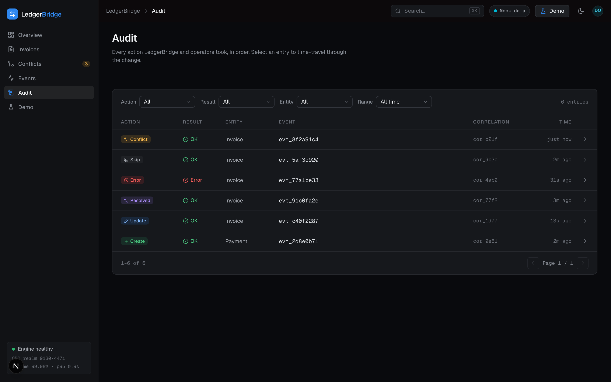
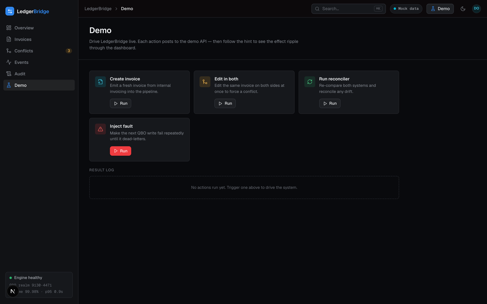

# LedgerBridge

**Two-way invoice sync between an internal invoicing system and QuickBooks Online (QBO)** — built to survive
the messiness of real integrations: duplicate, delayed and out-of-order events, incomplete webhook payloads,
and partial failures.

[**▶ Live dashboard**](https://ledgerbridge-web.vercel.app) · [API health](https://ledgerbridgeapi-production.up.railway.app/health) · [Design write-up](DESIGN.md) · [End-to-end flows](docs/E2E-FLOWS.md) · [Security](SECURITY.md)



Two ideas carry the whole design:

1. **A webhook is a ping, not the truth.** Every event triggers a **refetch** of the current state from the
   source before anything is applied — which neutralises out-of-order and incomplete payloads in one move.
2. **Every write is idempotent.** Reprocessing the same event N times yields the same result: no duplicate
   records, no repeated writes.

## Try it

The [live dashboard](https://ledgerbridge-web.vercel.app) drives the whole engine against a **real QBO
sandbox**. Open the **Demo** panel and:

- **Create invoice** → watch it move `pending → processing → done` on the Events log and appear as a linked
  invoice with a real QBO id.
- **Edit in both** → a conflict opens on the Conflicts queue (neither side clobbered); resolve it by picking a
  winner.
- **Inject fault** → the event retries with backoff, dead-letters, and you **replay** it.
- **Run reconciler** → drift from a missed webhook is caught and re-converged.

The dashboard falls back to bundled mock fixtures if the API is unreachable, so it's always explorable.

## Screenshots

| Landing — the two-way bridge | Invoices — field-level internal↔QBO diff |
|---|---|
| [](docs/screenshots/landing.png) | [](docs/screenshots/invoices-diff.png) |

| Conflicts — flag-and-hold, then resolve | Events — durable outbox, retries, dead-letter replay |
|---|---|
| [](docs/screenshots/conflicts-resolve.png) | [](docs/screenshots/events.png) |

| Audit — before→after time-travel | Demo — drive the engine live |
|---|---|
| [](docs/screenshots/audit.png) | [](docs/screenshots/demo.png) |

## What's inside

**Sync core (internal → QBO).** A signed-webhook ingest writes to a durable **`sync_events` outbox**; a
**worker** claims one event at a time with a `FOR UPDATE SKIP LOCKED` lease, **refetches** the current state,
maps it, and applies it **idempotently** (check-by-external-id before any create), recording the result to
`links` + `audit_log`. Failures retry with exponential backoff and dead-letter; the process drains in-flight
work on `SIGTERM`. The worker polls, and a Postgres **`LISTEN/NOTIFY`** trigger wakes it sub-second on a new
event (polling stays the floor).

**Reverse sync (QBO → internal) + loop prevention.** A `/webhooks/qbo` receiver (Intuit HMAC verify +
Change-Data-Capture parse) feeds the same outbox; the reverse processor refetches the QBO invoice and applies
it internally. Two guards stop the directions ping-ponging: our own write-back is recognised by the QBO
**`SyncToken`** we recorded, and the internal-side echo it triggers by the state **hash** — so a change made in
one system lands in the other **exactly once**.

**Conflict handling (edited in both).** Each link keeps the **last-synced snapshot**; before applying, both
sides are diffed against it. A **same-field divergence** (both moved the amount, differently) flags
`status='conflict'` and **holds both directions** — no clobber — until an operator resolves it; disjoint-field
edits apply independently and identical edits converge. Flag-and-hold rather than cross-clock last-write-wins,
so a real financial change is never silently dropped.

**Payments.** An internal payment syncs as a real QBO **`Payment`** with a `LinkedTxn` to the invoice (so QBO's
invoice Balance reflects it). Idempotent two ways: a `payment` link row and a stable `Request-Id`. The reverse
(a payment entered in QBO) is a documented deferral.

**Accounts (chart of accounts).** Internal GL accounts sync to QBO **`Account`** entities (internal → QBO).
Because a QBO `Account.Name` is unique, this path has the strongest idempotency: **check-before-create by
Name** adopts a create that landed but whose link write was lost (no duplicate), an unchanged re-delivery is
hashed and skipped, and a stable `Request-Id` adds Intuit's dedup. Raw GL `JournalEntry` posting is out of
scope by design — QBO auto-generates the journal entries from invoice/payment postings, so the chart of
accounts those postings reference is the meaningful thing to sync (see [DESIGN.md](DESIGN.md)).

**Reconciler (the safety net).** A periodic pass **matches** invoices that exist on both sides with no link
(by DocNumber + amount; ambiguity or a mismatch is flagged, never blindly linked) and **recovers drift** from
dropped webhooks: it refetches both sides and, when a version/hash has moved past what we last synced, enqueues
a **synthetic event** into the same idempotent outbox so the worker re-converges the state.

**Reliability under partial failure.** Durable outbox → leased worker (`pending → processing → done | dead`,
stale-lock reclaim) → exponential backoff with permanent-vs-transient classification (a non-retryable QBO 4xx
dead-letters immediately instead of burning the budget) → the reconciler as the catch-all for whatever the
outbox never saw → graceful `SIGTERM` drain. The **timeout-after-write "money shot"** is handled: a create
retried after a lost response is **adopted, not duplicated** (check-by-DocNumber first).

**Observability.** Every event, audit row and log line carries a `correlation_id`; the append-only `audit_log`
records before/after/result/error. Optional **OpenTelemetry** tracing (`OTEL_ENABLED`) spans the pipeline
(`sync.process_event` → `qbo.request`).

**Admin / observability API + operator dashboard.** A typed read API over the engine (`/status`, `/events`,
`/links`, `/conflicts`, `/audit` with detail routes) plus two operator actions — **`/conflicts/:id/resolve`**
and **`/events/:id/replay`** — its contract living as zod schemas in `packages/shared`. The Next.js dashboard
consumes it type-safely: Overview, an Invoices diff, the Conflicts queue, the Events log, an Audit time-travel
view, and the Demo panel — plus a marketing landing page.

The whole pipeline is **verified end-to-end against the real QBO sandbox** and covered by **86 deterministic
tests** (forward + reverse, including the no-loop round trip) on an in-process Postgres with a mocked QBO
boundary.

## Architecture

```
Internal system  ──signed webhook──▶ ┌───────────────────────────────┐ ──API write──▶ QuickBooks Online
   (/internal/*)                      │  ingest → outbox → worker      │                 (OAuth2, sandbox)
                 ◀──refetch+apply──   │  verify · dedupe · enqueue     │ ◀──CDC webhook──
                                      │  refetch → map → apply → audit │
                                      └───────────────┬───────────────┘
                                                      │ read / write
                              ┌──────────┬────────────┴───────────┬──────────────┐
                              │  links   │      sync_events        │  audit_log   │   + oauth_tokens
                              └──────────┴─────────────────────────┴──────────────┘
       loop prevention: QBO SyncToken (inbound echo) + state hash (internal echo)
```

See [`DESIGN.md`](DESIGN.md) for the architecture write-up and the reasoning behind each decision.

## Stack

- **TypeScript** across the board.
- **apps/api** — Fastify, Drizzle ORM + Postgres (Neon), Zod at every boundary, Vitest.
- **apps/web** — Next.js 16 (App Router) + Tailwind CSS v4 + shadcn/ui + lucide-react.
- **packages/shared** — Zod schemas and types shared by the API and the web app.
- **Deploy** — API + worker on Railway (a persistent service), web on Vercel, Postgres on Neon.

```
apps/
  api/    # Fastify: internal system, OAuth, ingest, sync worker, reconciler, admin API. Drizzle + db/.
  web/    # Next.js: landing page (/) + operator dashboard (/dashboard) + design gallery (/design).
packages/
  shared/ # canonical enums, types, status vocabulary, and the admin-API DTO schemas.
```

## Getting started

Requirements: Node 22+, a Postgres database (a free [Neon](https://neon.tech) project works), and an
[Intuit Developer](https://developer.intuit.com) app with a QBO **sandbox** company.

```bash
npm install
cp apps/api/.env.example apps/api/.env.local   # then fill it in (see below)
npm run db:migrate -w @ledgerbridge/api          # create the schema
npm run dev:api                                   # Fastify on :3001 (ingest + sync worker + reconciler)
npm run dev:web                                   # Next.js on :3000 (landing + dashboard + /design)
```

Connect a QBO sandbox by opening <http://localhost:3001/oauth/connect> and authorising the app.

| Variable | What it is |
|---|---|
| `DATABASE_URL` | Postgres connection string (Neon pooled). |
| `QBO_CLIENT_ID` / `QBO_CLIENT_SECRET` | Intuit app Development keys. |
| `QBO_REDIRECT_URI` | Must match a Redirect URI registered on the app (e.g. `http://localhost:3001/oauth/callback`). |
| `QBO_ENVIRONMENT` | `sandbox` or `production`. |
| `QBO_REALM_ID` | The connected sandbox company id (from the OAuth callback). |
| `QBO_DEFAULT_CUSTOMER` / `QBO_DEFAULT_ITEM` | The QBO Customer + Item the bridge maps internal invoices onto. |
| `QBO_WEBHOOK_VERIFIER_TOKEN` | Intuit webhook Verifier Token; the `/webhooks/qbo` reverse receiver registers only when set (otherwise the reconciler is the reverse-sync path). |
| `INTERNAL_WEBHOOK_SECRET` / `INTERNAL_WEBHOOK_TARGET` | HMAC key + URL for the simulated internal system's signed change webhooks. |
| `WEB_ORIGIN` | Allowed browser origin(s) for the dashboard (CORS; default `http://localhost:3000`). |
| `ADMIN_API_TOKEN` | Optional bearer token gating the admin/internal/demo routes (unset = open, for the demo). |
| `OTEL_ENABLED` / `OTEL_EXPORTER_OTLP_ENDPOINT` | Optional OpenTelemetry tracing. |

> The sync worker only starts when `QBO_REALM_ID`, `QBO_DEFAULT_CUSTOMER` and `QBO_DEFAULT_ITEM` are set.
> The dashboard renders on **mock fixtures** by default; set `NEXT_PUBLIC_API_URL` in `apps/web/.env.local` to
> point it at the live API (the topbar then flips to "Live").

```bash
npm run typecheck   # tsc across workspaces
npm run lint        # eslint across workspaces
npm run test        # vitest (api) — 86 tests against an in-process Postgres (PGlite)
```

## Tests

**86 tests** run against an in-process Postgres (PGlite) with the real migrations applied and a fake QBO
boundary, so they exercise the production schema — idempotency, the outbox, conflict detection, loop
prevention — without Docker or a remote database. Every spec edge case is covered: duplicate webhook
(UNIQUE `event_id`), out-of-order (refetch beats a stale payload), edited-in-both → conflict, delete→void
(both directions), timeout-after-write ("money shot": adopt-by-DocNumber, no duplicate), retry with
backoff → dead-letter, permanent 4xx → immediate dead-letter, payments, the reconciler (match + drift),
and a full QBO→internal round trip with the **echo dropped in both directions** (proving no loop). See
[`DESIGN.md`](DESIGN.md#testing-strategy) for the strategy and [`docs/E2E-FLOWS.md`](docs/E2E-FLOWS.md) for
the 10 reproducible end-to-end flows.

## Assumptions & tradeoffs

- **Flag-and-hold, not last-write-wins.** Auto-resolving a same-field money conflict by `updatedAt` trusts two
  unsynchronised clocks (our server vs Intuit) and can silently drop a real change, so a same-field amount
  divergence holds both sides until an operator decides.
- **DB outbox + polling worker, not a managed queue.** A `sync_events` table with a `FOR UPDATE SKIP LOCKED`
  lease gives exactly-once processing with no external infra; SQS/Inngest is the production scale path. The
  worker + reconciler are poll loops, so the API runs as a **persistent service** (not serverless).
- **Per-link refetch in the reconciler, not CDC.** No cursor to get wrong, reuses the existing read+hash;
  QBO's Change-Data-Capture endpoint is the production path.
- **The "internal" system is simulated.** `apps/api` ships a minimal Postgres-backed invoicing service
  (`/internal/*`) that emits HMAC-signed change webhooks — enough to demonstrate genuine two-way sync.
- **One connected sandbox realm; admin auth is opt-in.** Multi-tenant isolation is out of scope (the data
  model already carries `realm_id`); the admin surface has an optional `ADMIN_API_TOKEN` bearer guard, left
  unset in the demo so reviewers can drive it.
- **Amount is the only field that round-trips both ways**, so it's the conflict surface; deletes map to QBO
  **voids** (a zeroed, audit-preserving record). Reverse Payment sync (QBO → internal) is deliberately deferred.
- **GL accounts sync internal → QBO** (the chart of accounts, as QBO `Account` entities); raw GL `JournalEntry`
  posting is out of scope because QBO derives the journal entries from invoice/payment postings, so syncing the
  chart of accounts is the non-duplicating slice. Reverse (QBO → internal) account sync is deferred too.

The full reasoning is in [`DESIGN.md`](DESIGN.md); what would change for production is in its "Decisions made"
and the [`SECURITY.md`](SECURITY.md) hardening roadmap.

## Security

[`SECURITY.md`](SECURITY.md) has the threat model, an independent audit, and the hardening roadmap. In brief:
secrets live only in `.env.local` (gitignored); the internal webhook + the QBO webhook are HMAC-verified in
constant time; the OAuth callback validates a signed, expiring `state` and pins the realm; inbound ids are
zod-constrained at the boundary; and the admin surface sits behind an optional bearer guard.
